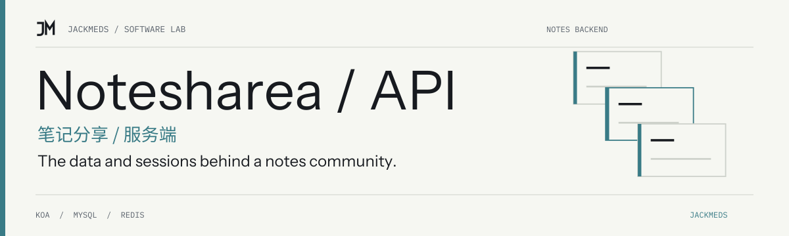

<!-- jackmeds-brand:start -->
<picture>
  <source media="(prefers-color-scheme: dark)" srcset="assets/brand/hero-dark.svg">
  
</picture>
<!-- jackmeds-brand:end -->

# Notesharea Server · 笔记分享 API

为 Notesharea 的笔记、用户、收藏和讨论提供 Koa API，连接 MySQL 数据与 Redis 会话。

The Koa backend for Notesharea, a note-sharing project with separate reader and administration frontends.

## 三个仓库如何配合

| 仓库 | 职责 | 本地入口 |
|---|---|---|
| **本仓库** | Koa API、Sequelize 模型与 Redis 会话 | 默认 `http://localhost:3000` |
| [Notesharea-web](https://github.com/JackMeds/Notesharea-web) | 浏览、创作与讨论笔记 | Vite 开发服务 |
| [Notesharea-admin](https://github.com/JackMeds/Notesharea-admin) | 用户列表、笔记列表与推荐管理 | Vue CLI 开发服务 |

请先准备后端，再启动需要使用的前端。Notesharea 与 [HaoXing](https://github.com/JackMeds/HaoXing) 是独立项目，不共享必需的部署服务。

## 已有接口

- `/api/user`：注册、登录、退出、个人资料及用户列表。
- `/api/admin`：管理员注册与登录。
- `/api/note`：笔记列表、详情、创建、更新、删除、点赞、收藏和推荐管理。
- `/api/comment_and_reply`：评论、回复与讨论列表。

请求方法与参数以 [API 路由](src/routes/api) 为准。数据库关系见 [模型定义](src/db/model/index.js) 和 [原有 E-R 图](MYSQL_E-R图.png)。

## 本地开发

准备 Node.js、npm、MySQL 与 Redis。仓库未固定 Node 版本。先检查 [数据库配置](src/conf/db.js)，创建对应的本地数据库，并将连接配置与 [会话配置](src/conf/secretKeys.js) 设置为你自己的开发值。

在本仓库目录安装依赖：

```bash
npm install
```

确认连接的是用于本项目的开发数据库后，现有 Sequelize 同步入口可创建尚不存在的表：

```bash
node src/db/sync.js
```

该命令会连接并修改所配置的数据库结构，请勿指向不属于本项目的数据库。然后启动开发服务：

```bash
npm run dev
```

API 默认端口是 `3000`，`bin/www` 支持 `PORT` 环境变量。开发脚本同时启用 `9229` 调试端口。`npm start` 使用普通 Node 启动，不带自动重载。

前后端联调使用 `localhost`：当前 CORS 白名单包含 `http://localhost:5173` 和 `http://localhost:8080`，会话通过 Cookie 保持。改变前端域名或端口时，需要同步调整 [app.js](src/app.js) 中的允许来源。

## 检查与使用边界

`npm run lint` 与 `npm test` 是现有检查入口；当前测试仅含一个加法示例，不代表 API、会话或数据库功能已经受测试覆盖。本次文档整理核对了启动脚本和源码，未启动数据库或执行完整前后端联调。

用户资料、笔记和互动数据存入 MySQL，登录会话使用 Redis。现有源码中的配置需要在部署前按实际环境调整；本页没有把它标记为已经完成生产部署验证的服务。

## 许可

当前仓库没有项目级许可证文件或 `package.json` 许可证声明。本次整理不新增授权；依赖仍按各自许可证使用。
